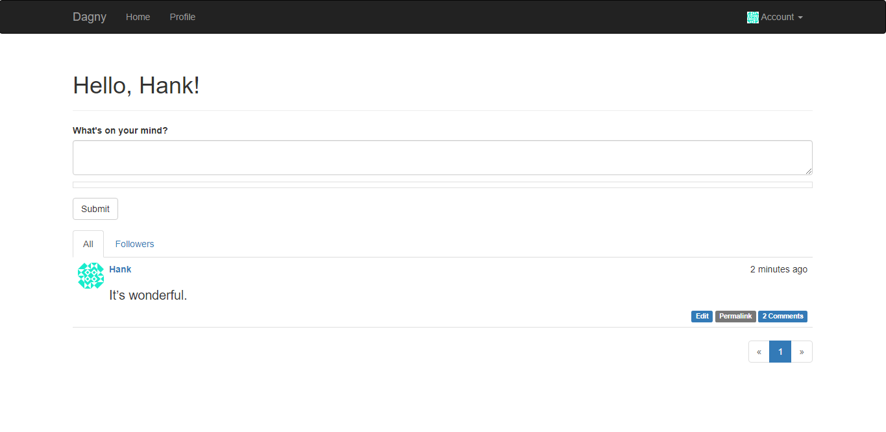

# Blogging Platform

A blogging platform using Flask, Jinja2 and PostgreSQL.

## Demo

[See Demo deployed on Heroku](https://flask-blogging-platform.herokuapp.com/)

  

## Core features

Based on [Flask Web Development](https://www.amazon.fr/Flask-Web-Development-Developing-Applications/dp/1491991739) by Miguel Grinberg (2nd edition, 2018)
